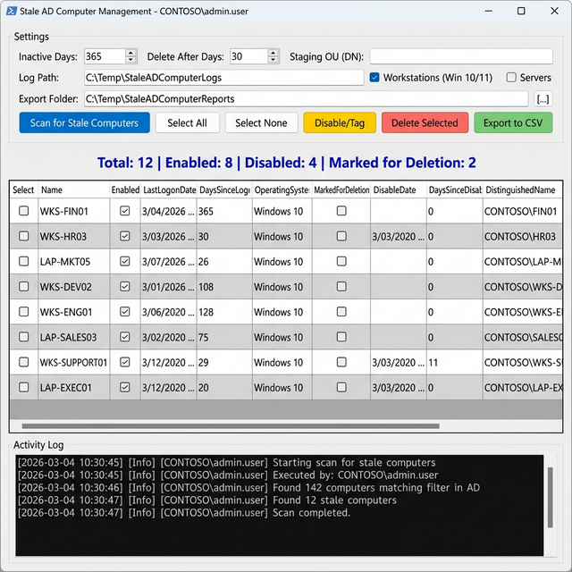
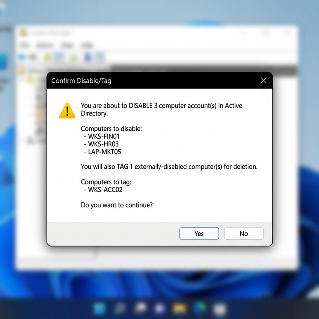
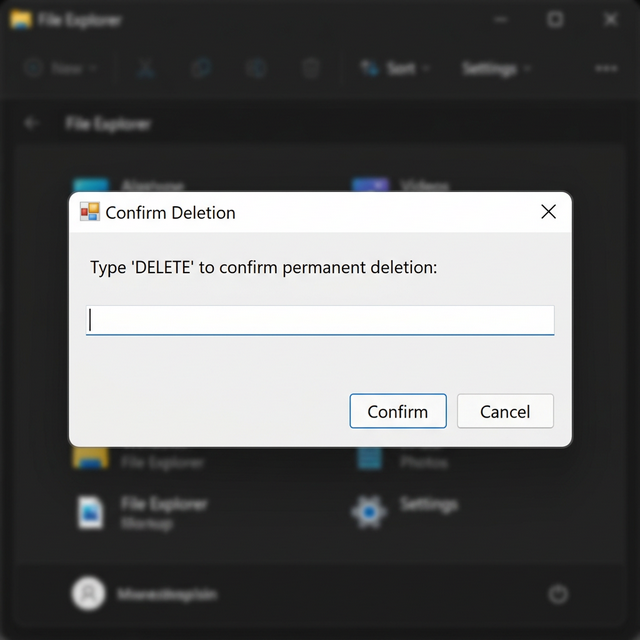

# Stale AD Computer Management GUI - User Guide

## Overview

The **Stale AD Computer Management GUI** (`Manage-StaleADComputers-GUI.ps1`) provides a Windows Forms-based graphical interface for managing stale computer objects in Active Directory. It implements a safe, 3-stage lifecycle approach:

1. **Identify** - Scan for workstations/servers inactive for a specified time
2. **Disable/Tag** - Disable active accounts and tag them for future deletion
3. **Delete** - Permanently remove computers that have been disabled for a safety period

> **Scope:** This tool allows you to target **Windows Workstations**, **Windows Servers**, or both through configurable checkboxes. By default, it prioritizes Workstations for safety.

---

## Prerequisites

- **PowerShell 5.1** or later
- **Active Directory PowerShell module** — automatically installed at launch if missing
  - Windows 10/11: Installed via `Add-WindowsCapability` (RSAT)
  - Windows Server: Installed via `Install-WindowsFeature`
  - Requires **Administrator** privileges for first-time auto-install
- Appropriate AD permissions to:
  - Query computer objects
  - Disable computer accounts
  - Move objects between OUs (if using Staging OU)
  - Delete computer objects

---

## Launching the GUI

```powershell
.\Manage-StaleADComputers-GUI.ps1
```

The window will open centered on your screen. The **title bar** displays the current operator, for example:

```
Stale AD Computer Management - CONTOSO\admin.user
```



---

## GUI Elements

### Settings Panel

The top section contains configuration options organized in four rows.

#### Row 1: Core Settings

| Element | Description | Default | Min | Max |
|---------|-------------|---------|-----|-----|
| **Inactive Days** | Number of days since last logon to consider a computer "stale" | `365` | `30` | `730` |
| **Delete After Days** | Minimum days a computer must be disabled before it can be deleted (safety buffer) | `30` | `7` | `365` |
| **Staging OU (DN)** | Distinguished Name of an OU to move disabled computers to. Leave empty to keep computers in their current location. | *(empty)* | N/A | N/A |

**Example Staging OU:**
```
OU=Disabled Computers,OU=Workstations,DC=contoso,DC=com
```

#### Row 2: Logging and Filtering

| Element | Description | Default |
|---------|-------------|---------|
| **Log Path** | Directory where operation log files are saved | `C:\Temp\StaleADComputerLogs` |
| **Include OS Types** | Checkboxes to include **Workstations** and/or **Servers** | `Workstations` checked |

#### Row 3: Export Path

| Element | Description | Default |
|---------|-------------|---------|
| **Export Folder** | Directory where CSV reports are saved | `C:\Temp\StaleADComputerReports` |
| **[...] Button** | Opens a folder browser to select the export folder | N/A |

#### Row 4: Action Buttons

| Button | Color | Description |
|--------|-------|-------------|
| **Scan for Stale Computers** | Blue | Queries AD for computers matching the inactive days threshold |
| **Select All** | Default | Checks the "Select" checkbox for all rows in the grid |
| **Select None** | Default | Unchecks the "Select" checkbox for all rows |
| **Select Eligible** | Dark Red | Auto-selects only computers eligible for deletion (disabled past threshold or externally disabled) |
| **Disable/Tag** | Yellow | Disables selected enabled computers and/or tags already-disabled computers for deletion |
| **Delete Selected** | Red | Permanently deletes selected disabled computers (requires confirmation) |
| **Export to CSV** | Green | Exports the current scan results to a timestamped CSV file |

> **Note:** The Select Eligible, Disable/Tag, Delete, and Export buttons are disabled until a scan is performed.

---

### Summary Bar

Located below the settings panel, displays real-time statistics:

```
Total: 12 | Enabled: 8 | Disabled: 4 | Marked for Deletion: 2
```

- **Total** - Number of stale computers found
- **Enabled** - Computers with active AD accounts
- **Disabled** - Computers with disabled AD accounts
- **Marked for Deletion** - Computers tagged by this script with a `DISABLED: YYYY-MM-DD` timestamp

---

### Data Grid

The main data grid displays scan results with the following columns:

| Column | Description |
|--------|-------------|
| **Select** | Checkbox to select computers for bulk operations |
| **Name** | Computer name (NetBIOS name) |
| **Enabled** | `True` if the AD account is enabled, `False` if disabled |
| **LastLogonDate** | Date of last logon (YYYY-MM-DD format) or "Never" |
| **DaysSinceLogon** | Number of days since last logon |
| **OperatingSystem** | Operating system (Windows 10, Windows 11, etc.) |
| **MarkedForDeletion** | `True` if tagged by this script for deletion |
| **DisableDate** | Date when the computer was disabled (if tagged) |
| **DaysSinceDisabled** | Days since the computer was disabled |
| **DistinguishedName** | Full AD path of the computer object |

**Grid Features:**
- Alternating row colors for readability
- Click column headers to sort
- Multi-row selection supported
- Checkbox in "Select" column for bulk operations

---

### Activity Log

The bottom panel shows a dark-themed, read-only log with timestamped entries that include the **operator's identity**:

```
[2026-03-04 10:30:45] [Info] [CONTOSO\admin.user] Starting scan for stale computers
[2026-03-04 10:30:45] [Info] [CONTOSO\admin.user] Executed by: CONTOSO\admin.user
[2026-03-04 10:30:46] [Info] [CONTOSO\admin.user] Found 142 computers matching filter in AD
[2026-03-04 10:30:47] [Info] [CONTOSO\admin.user] Found 12 stale computers
[2026-03-04 10:30:47] [Info] [CONTOSO\admin.user] Scan completed.
```

**Log Levels:**
- **Info** - Normal operations
- **Warning** - Non-critical issues or skipped items
- **Error** - Operation failures

Logs are also saved to files in the configured **Log Path** directory.

---

## Workflow Guide

### Step 1: Configure Settings

1. Set **Inactive Days** to your organization's policy (default: 365 days = 1 year)
2. Set **Delete After Days** safety buffer (default: 30 days)
3. Optionally specify a **Staging OU** to quarantine disabled computers
4. Verify **Log Path** and **Export Folder** are accessible

### Step 2: Scan for Stale Computers

1. Click **Scan for Stale Computers**
2. Wait for the scan to complete (progress shown in Activity Log)
3. Review the summary bar and data grid results

### Step 3: Review and Export

1. Click **Export to CSV** to save results for review
2. Share the report with stakeholders if needed
3. Files are named: `StaleComputers_Report_YYYYMMDD_HHMMSS.csv`

### Step 4: Disable/Tag Computers

1. Select computers using checkboxes or **Select All**
2. Click **Disable/Tag**
3. Review the confirmation dialog showing:
   - Number of computers to disable (currently enabled)
   - Number of computers to tag (already disabled externally)
4. Click **Yes** to proceed



**What happens:**
- **Enabled computers** → Disabled, description updated with `DISABLED: YYYY-MM-DD`, optionally moved to Staging OU
- **Already disabled (untagged) computers** → Description updated with deletion tag only

### Step 5: Delete Computers (After Safety Period)

1. Wait for the **Delete After Days** period to pass
2. Run another scan
3. Click **Select Eligible** to automatically check only computers that meet deletion criteria
   - Computers tagged by this script and disabled for ≥ the **Delete After Days** threshold
   - Computers disabled externally (no tag) — eligible immediately
4. Review the selection, then click **Delete Selected**
5. First confirmation dialog: Review the list, click **OK**
6. Second confirmation: Type `DELETE` (case-sensitive) and click **Confirm**



### Deletion Logic: Managed vs. Unmanaged

The **Delete Selected** button handles objects differently based on their state to balance safety with flexibility:

1.  **Managed Objects (Tagged by Script)**:
    *   Identified by a `DISABLED: YYYY-MM-DD` tag in the description.
    *   **Behavior**: Enforces the **Delete After Days** safety threshold.
    *   **Purpose**: Ensures a "cooling off" period for computers disabled by this tool, allowing them to be easily recovered if disabled in error.

2.  **Unmanaged Objects (Externally Disabled)**:
    *   Already disabled in AD but missing the script's timestamp tag.
    *   **Behavior**: Can be **deleted immediately**, bypassing the safety threshold.
    *   **Purpose**: Assumes manual vetting has already occurred for objects disabled outside of this script.

3.  **Safety Lock**:
    *   The script will **refuse to delete any enabled account**, even if it matches the stale criteria. It must be disabled first.

---

## Safety Features

### Multi-Layer Confirmation

| Action | Confirmation Required |
|--------|----------------------|
| Disable/Tag | Yes/No dialog |
| Delete | OK/Cancel dialog + type "DELETE" |

### Audit Trail

All operations capture the **operator identity** (`DOMAIN\Username`) and are logged to:

- **On-screen** Activity Log (includes user in every line)
- **Title bar** shows current operator
- **Log files** in the configured Log Path:
  - `StaleADComputers_YYYYMMDD.log` - Session log with operator identity
  - `DisableTagActions_YYYYMMDD_HHMMSS.csv` - Disable/tag results with `PerformedBy`
  - `DeleteActions_YYYYMMDD_HHMMSS.csv` - Delete results with `PerformedBy`

#### Action CSV Fields

| Field | Description |
|-------|-------------|
| ComputerName | Name of the computer acted upon |
| Action | `Disabled`, `Tagged`, or `Deleted` |
| Status | `Success` or `Failed` |
| **PerformedBy** | `DOMAIN\Username` of the operator who ran the action |
| Timestamp | Date/time of the action |

### Description Tracking

Disabled computers are tagged in their AD Description field:
```
DISABLED: 2026-02-17 | Original: Finance PC | Stale 365+ days
```

This allows:
- Tracking when the computer was disabled
- Preserving the original description
- Calculating days since disabled for deletion safety

### Staging OU (Optional)

If configured, disabled computers are moved to a quarantine OU, making it easy to:
- Isolate disabled accounts
- Review before permanent deletion
- Restore if disabled in error

---

## Parameter Reference

### Numeric Controls

| Parameter | Default | Minimum | Maximum | Description |
|-----------|---------|---------|---------|-------------|
| Inactive Days | 365 | 30 | 730 | Days of inactivity to flag as stale |
| Delete After Days | 30 | 7 | 365 | Safety buffer before deletion allowed |

### Text Fields

| Field | Default | Description |
|-------|---------|-------------|
| Staging OU (DN) | *(empty)* | Target OU for disabled computers |
| Log Path | `C:\Temp\StaleADComputerLogs` | Directory for log files |
| Export Folder | `C:\Temp\StaleADComputerReports` | Directory for CSV exports |

---

## Troubleshooting

### Module Installation Failures

If the automatic RSAT installation fails:
- Ensure PowerShell is running **as Administrator**
- Windows 10/11: Verify internet access (required for RSAT install via `Add-WindowsCapability`)
- Windows Server: Verify the `ServerManager` module is available
- Manual install: `Add-WindowsCapability -Online -Name "Rsat.ActiveDirectory.DS-LDS.Tools~~~~0.0.1.0"`

### "Access Denied" Errors

Ensure your account has:
- Read access to query computers
- Write access to modify computer properties (disable, update description)
- Delete access to remove computer objects
- Move access if using Staging OU

### No Computers Found

- Verify the **Inactive Days** threshold isn't too low
- Check that Windows 10/11 workstations exist in your AD
- Ensure you have read permissions across relevant OUs

### Staging OU Errors

- Verify the Distinguished Name format is correct
- Ensure the OU exists in AD
- Confirm you have move permissions to the target OU

---

## File Outputs

| File Pattern | Content |
|--------------|---------|
| `StaleComputers_Report_*.csv` | Scan results export |
| `StaleADComputers_*.log` | Session activity log with operator identity |
| `DisableTagActions_*.csv` | Disable/tag operation results with `PerformedBy` |
| `DeleteActions_*.csv` | Delete operation results with `PerformedBy` |

All timestamps use format: `YYYYMMDD` for logs and `YYYYMMDD_HHMMSS` for CSV exports.
