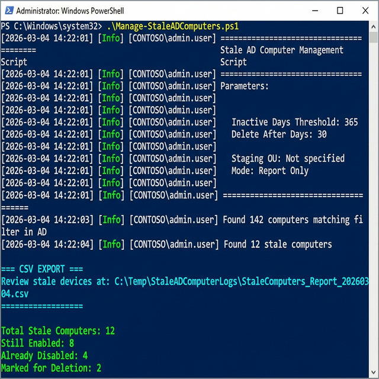

# Stale AD Computer Cleanup

## Overview

This folder contains scripts for managing stale computer objects in Active Directory, following industry best practices for a **Hybrid Azure AD Join** environment.

**Key Features:**
- Target **Workstations** (Win 10/11), **Servers**, or both via configurable filters
- Scope scans to a specific **OU / Search Base** or search the entire domain
- Industry best practice 3-stage lifecycle with safety buffer before deletion
- **Row color coding** — visual lifecycle status at a glance
- **Select Eligible** button for one-click selection of deletion-ready computers
- **Re-enable** incorrectly disabled computers with automatic description restoration
- **Right-click context menu** for quick single-computer actions
- Live **grid filter** to find computers by name or OU in large result sets
- Automatic RSAT module installation — no manual prerequisites
- Full audit trail with operator identity in every log entry and CSV record
- Command-line script for automation and GUI version for interactive use
- Built-in safety confirmations prevent accidental deletions

## Screenshots

### GUI Version


### Console Version



### Safety Confirmations


## Industry Best Practices

### 3-Stage Lifecycle Approach

| Stage | Timing | Action | Reversible |
|-------|--------|--------|------------|
| **Identify** | 365+ days inactive (configurable) | Report and flag | Yes |
| **Disable** | After review | Disable account, move to staging OU, tag with date | Yes — use Re-enable |
| **Delete** | 30+ days after disable | Permanently remove from AD | No |

### Why This Approach?

1. **Safety**: 30-day buffer after disabling allows for recovery if a computer was incorrectly flagged
2. **Visibility**: Moving to a staging OU makes review easy
3. **Audit Trail**: Description tagging preserves when and why accounts were disabled; operator identity captured in every log and CSV record
4. **Hybrid Sync**: Deletions sync to Azure AD/Intune via Azure AD Connect
5. **Recovery**: Re-enable action restores the original AD description from the embedded tag

### Key Attributes for Staleness Detection

| Attribute | Description | Replication |
|-----------|-------------|-------------|
| `LastLogonTimestamp` | Most reliable indicator | Every ~14 days |
| `pwdLastSet` | Computer password auto-changes every 30 days | Replicated |
| `whenChanged` | Any attribute modification | Replicated |

## Scripts

### Manage-StaleADComputers.ps1

Command-line script implementing the 3-stage lifecycle. Ideal for automation and scheduled tasks.

### Manage-StaleADComputers-GUI.ps1

Windows Forms GUI version for interactive use. See [HOWTO-GUI.md](HOWTO-GUI.md) for detailed documentation.

#### Usage Examples

```powershell
# Stage 1: Report Only (recommended first step)
.\Manage-StaleADComputers.ps1 -ReportOnly

# Stage 2: Disable stale computers and move to staging OU
.\Manage-StaleADComputers.ps1 -DisableStale -StagingOU "OU=ToBeDeleted,OU=Computers,DC=contoso,DC=com"

# Stage 3: Delete computers disabled for 30+ days
.\Manage-StaleADComputers.ps1 -DeleteDisabled

# Custom thresholds
.\Manage-StaleADComputers.ps1 -ReportOnly -InactiveDays 120 -DeleteAfterDays 45

# Target Servers only
.\Manage-StaleADComputers.ps1 -IncludeServers -ReportOnly
```

#### Parameters

| Parameter | Default | Description |
|-----------|---------|-------------|
| `-InactiveDays` | 365 | Days of inactivity before considered stale (min: 30, max: 730) |
| `-DeleteAfterDays` | 30 | Days after disable before deletion (min: 7, max: 365) |
| `-StagingOU` | (none) | DN of OU for disabled computers |
| `-LogPath` | C:\Temp\StaleADComputerLogs | Log file location |
| `-ExportPath` | (auto-generated) | Custom path for CSV report export |
| `-IncludeWorkstations` | `true` (if both empty) | Include Windows 10/11 workstations |
| `-IncludeServers` | `false` | Include Windows Server operating systems |
| `-ReportOnly` | - | Generate reports without changes (default mode) |
| `-DisableStale` | - | Disable stale computers |
| `-DeleteDisabled` | - | Delete disabled computers past retention |
| `-Force` | - | Skip confirmation prompts (use with caution) |

> **Note:** By default, the script targets Workstations only. Use `-IncludeServers` to expand the scope to server operating systems.

#### Confirmation Requirements

| Action | Without `-Force` | With `-Force` |
|--------|------------------|---------------|
| Disable | Type `YES` to confirm | No prompt |
| Delete | Type `DELETE` to confirm | No prompt |

#### Deletion Safety Logic
- **Managed Accounts**: Computers disabled by this script (tagged in description) are protected by the `-DeleteAfterDays` threshold.
- **Unmanaged Accounts**: Accounts found already disabled (untagged) can be deleted immediately.
- **Enabled Accounts**: The script will **never** delete an enabled account; objects must be disabled first.

## Recommended Workflow

### Weekly Schedule

| Day | Task | Script Mode |
|-----|------|-------------|
| Monday | Generate fresh report | `-ReportOnly` |
| Tuesday | Review report, identify exceptions | Manual review |
| Wednesday | Disable stale computers | `-DisableStale` |
| Friday | Delete computers past retention | `-DeleteDisabled` |

### Initial Deployment

1. **Run report mode first**: Review output before making any changes
2. **Create staging OU**: e.g., `OU=ToBeDeleted,OU=Computers,DC=contoso,DC=com`
3. **Validate exclusions**: Ensure critical systems are excluded
4. **Test with small batch**: Start with a subset before full deployment
5. **Monitor Azure AD sync**: Verify deletions propagate correctly

## Output Files

Reports and action logs are saved to the configured **Export Folder** (default: `C:\Temp\StaleADComputerReports`).
Activity logs are saved to the configured **Log Path** (default: `C:\Temp\StaleADComputerLogs`).

| File Pattern | Saved To | Content |
|---|---|---|
| `StaleADComputers_YYYYMMDD.log` | Log Path | Detailed activity log with operator identity |
| `StaleComputers_Report_YYYYMMDD_HHMMSS.csv` | Export Folder | Full computer inventory |
| `DisableTagActions_YYYYMMDD_HHMMSS.csv` | Export Folder | Record of disabled/tagged computers with `PerformedBy` |
| `DeleteActions_YYYYMMDD_HHMMSS.csv` | Export Folder | Record of deleted computers with `PerformedBy` |
| `ReEnableActions_YYYYMMDD_HHMMSS.csv` | Export Folder | Record of re-enabled computers with `PerformedBy` |

### Log Format

Every log line includes the operator's identity for audit purposes:

```
[2026-03-04 10:30:45] [Info] [CONTOSO\admin.user] Starting scan for stale computers
[2026-03-04 10:30:46] [Warning] [CONTOSO\admin.user] Skipping PC001 - only disabled for 15 days
[2026-03-04 10:30:47] [Error] [CONTOSO\admin.user] Failed to delete PC002: Access denied
```

### Action CSV Fields

All action CSVs (Disable/Tag, Delete, Re-enable) include:

| Field | Description |
|-------|-------------|
| ComputerName | Name of the computer acted upon |
| Action | `Disabled`, `Tagged`, `Deleted`, or `Re-enabled` |
| Status | `Success` or `Failed` |
| PerformedBy | `DOMAIN\Username` of the operator |
| Timestamp | Date/time of the action |

## Report Fields

| Field | Description |
|-------|-------------|
| Name | Computer name |
| Enabled | Account enabled status |
| DistinguishedName | Full AD path |
| LastLogonDate | Last authentication timestamp |
| DaysSinceLogon | Days since last logon |
| PasswordLastSet | Last password change |
| OperatingSystem | Windows version |
| MarkedForDeletion | Tagged with disable date |
| DaysSinceDisabled | Days since account was disabled |

## Hybrid Azure AD Join Considerations

- **Azure AD Connect Sync**: Deleted AD objects are removed from Azure AD within the sync cycle (default 30 min)
- **Intune**: Stale device records will be removed after Azure AD sync
- **Conditional Access**: Disabled/deleted devices lose access immediately
- **BitLocker Keys**: Consider backing up BitLocker recovery keys before deletion

## Prerequisites

- **PowerShell 5.1** or later
- **Active Directory PowerShell module** — automatically installed if missing
  - Windows 10/11: installed via `Add-WindowsCapability` (RSAT)
  - Windows Server: installed via `Install-WindowsFeature RSAT-AD-PowerShell`
  - Requires **Administrator** privileges for automatic installation
- Permissions to read, disable, move, and delete computer objects
- Write access to log directory
- For GUI: .NET Framework (Windows Forms)

## Documentation

- [HOWTO-GUI.md](HOWTO-GUI.md) - Detailed GUI user guide with all controls and workflows
